# metiq

metiq is a tool to measure timing distortions caused by media paths. Right now it measures (a) a/v sync and (b) video smoothness, and can be adapted to measure end-to-end latency.


# 1. Introduction

metiq is a tool to measure timing distortions caused by media paths, in particular a/v sync and video smoothness degradation. It does not care about the media quality (audio or video distortion) itself. For that, [VMAF](https://github.com/Netflix/vmaf) is a good option for video, and [visqol](https://github.com/google/visqol) is a good option for audio.

## 1.1. A/V Sync
[A/V sync](https://en.wikipedia.org/wiki/Audio-to-video_synchronization) is the property of an audio and video file to be synchronized. It is also known as "lipsync", as lack of synchronization between human lips and voice is the most noticeable symptom of bad a/v sync. It is commonly measured as amount of time the audio departs from perfect synchronization with the video, more concretely the difference between the timestamp where audio should be playing to be in perfect synchronization with video, minus the timestamp where the audio is actually playing. This value is zero if a/v sync is perfect, positive if the audio is earlier than it should be (meaning in sync with video), and negative if the audio is later than it should be.

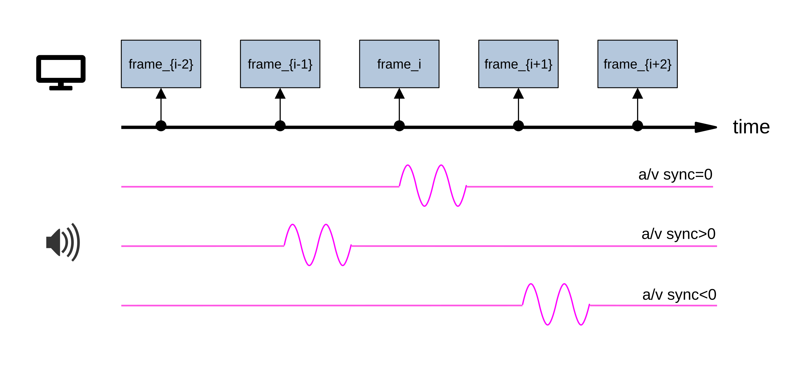

Figure 1 shows an example of a media stream composed of a video stream and different audio streams. Let's assume the audio (depicted as a 1-dimensional pink signal) should be all zero, except at video frame i (video is depicted using blue boxes), where it must play a small sin signal. Note that the top audio signal is perfectly in sync with the video: The a/v sync is zero. The middle audio signal is being played earlier than it should, so the a/v sync value is positive. The bottom audio signal is being played later than it should, so the a/v sync value is negative.

A/V sync issues are well-known in the industry. They occur in devices that have audio and video recording or rendering paths with different sizes. For example, the audio rendering path in HDMI devices is very often longer than the video rendering path in HDMI systems. This is particularly noticeable when using a soundbar. Also, audio and video capture pipelines (from mic/camera to network) tend to be of significantly different sizes. While there are solutions for this (taking timestamps as early as possible), they are sometimes ignored.

Some papers/standards defining A/V sync limitations include:

* [R. Steinmetz, "Human Perception of Jitter and Media Synchronization"](https://ieeexplore.ieee.org/document/481694) suggests up to 80 ms in each direction to be acceptable.
* [EBU R37-2007](https://tech.ebu.ch/docs/r/r037.pdf) defines a goodness range of [40 ms, -60 ms].
* [ITU-R BT.1359-1](https://www.itu.int/rec/R-REC-BT.1359/en) defines a detectability range of [+45 ms, -125 ms], and an acceptability range of [+90 ms, -185 ms].

Note that A/V sync is asymmetric, with audio earlier (positive values) being problematic at lower values than video earlier (negative values).


## 1.2. Video Smoothness

Video smoothness is the property of video frames to be rendered in the exact order that they were created. Let's assume a video is composed of multiple frames, each numbered consecutively. The actual video frames at origin are therefore `{f0, f1, f2, f3, f4, f5, f6, ...}`. There are some well-known sources of video smoothness issues, namely framerate conversion and adaptation.

Framerate conversions: Some media systems change the video framerate, often for performance reasons. For example, some media paths may convert your 30 fps video into a 15 fps video.

* (1) lazy framerate conversions: A simple mechanism to change framerates is by matching timestamps and using as output frame at time `t` the last frame in the input at time `t`. For example, for 30-to-15 fps conversions, the first frame in the output occurs at time `t=0`. At that time, the last input frame is frame f0. The second frame in the output occurs at time `t=1/15=0.067`. At that time, the last input frame is frame f2. Note that frame f1 is not copied. The final result is equivalent the dropping each other input frame: The video frames in the output will be `{f0, f2, f4, f6, ...}`.

For 30-to-60 fps conversions, the first frame in the output occurs at time `t=0`. At that time, the last input frame is frame f0. The second frame in the output occurs at time `t=1/60=0.017`. At that time, the last input frame is still frame f0 (the next input frame happens at `t=1/30=0.033`). Therefore the second output frame is again frame f0. This is equivalent to duplicating every frame. The video frames in the output will be `{f0, f0, f1, f1, f2, f2, f3, f3, ...}`.

Conversions where the ratio between input and output framerates is not an integer number produce jankier video outputs. For example, let's consider a 30-to-20 framerate conversion. The first frame in the output occurs at time `t=0`. At that time, the last input frame is frame f0. The second frame in the output occurs at time `t=1/20=0.05`. At that time, the last input frame is already frame f1 (which arrived at `t=1/30=0.033`). The third frame in the output occurs at time `t=2/20=0.1`. The input frame at that time is frame f3 (which arrived at `t=3/30=0.1`). The video frames in the output will be `{f0, f1, f3, f4, f6, f7, f9, ...}`. Note that, for every 3 consecutive frames, 2 are kept and 1 is dropped.

* (2) interpolation-based framerate conversions: Another mechanism to change framerates is by interpolating frames. In this mechanism, the output frame at time `t` is a function of 2x consecutive input frames, `mix(f1, f2)`. The frames used are those whose timestamps are `t1` and `t2` and where `t1 <= t < t2`. Let's consider the previous 30-to-60 fps conversion. In this case, the output frame at time `t=0` will be the first input frame (f0). The second frame in the output occurs at time `t=1/60=0.017`. At that time, the previous input frame is frame f1, while the next input frame is frame f2 (which happens at `t=1/30=0.033`). So the second output frame is obtained as `mix(f0, f1)`. The final output video will be `{f0, mix(f0, f1), f1, mix(f1, f2}, f2, ...}`. Note that the `mix()` functions typically merge frames by mixing the lumas of the frames. For example, when interpolating one black frame (where the luma is 0) and one white frame (where the luma is 255), the interpolated frame has a luma of 128 (gray frame).

This is what the [ffmpeg minterpolate filter](http://ffmpeg.org/ffmpeg-filters.html#minterpolate) uses by default.

Effective framerate conversions: There are several physical processes in video paths that effectively cause framerate conversions:

* (1) Displays typically render video at a per-display constant speed, known as the ["`VSYNC`"](https://source.android.com/devices/graphics/implement-vsync). The display's renderer wakes up every `1/VSYNC` seconds, gets a frame, and renders it. If there is no frame available at the exact `VSYNC` moment, it will render the previous frame again. This is equivalent to a lazy framerate conversion, where the output framerate is always the `VSYNC`. Assuming that the `VSYNC` is 60 Hz (this is the typical Android value), the rendered frames will be `{f0, f0, f2, f2, f4, f4, f6, f6, ...}` for a 30 fps source.

* (2) Cameras, on the other hand, work as an interpolation-based framerate conversion when the video they are recording comes from an actual display. Let's assume a camera that works at a given frequency `F`. The camera sensor has a exposure time of `X` ms, where `X` may vary (depending on the amount of light), but must be `X < 1/F`. The problem here is the adaptation between a display and a camera working at either the same or different frequencies. For example, if the camera works at half the framerate than the display, the camera sensor may be open while 2x different frames are rendered in the display. This causes the captured frame to be a luma-averaged mix of the 2x source frames. The problem occurs even if the frequencies are the same, but there is a phase difference. In the worst case, the camera sensor will be open for `X/2` ms while the display sensor is showing frame `fi`, and for `X/2` ms while the display sensor is showing frame `f_{i+1}`. If this happens, the captured frame will contain a mix of 2x frames, similar to the `mix()` function described above.

* (3) Note that the (lazy framerate conversion) `VSYNC` adaptation mechanism is actually used as a generic buffering mechanism between video-frame producers and consumers in low-latency environments. In order to keep a producer and a consumer of video frames working with each other using separate processes, the consumer implements a `VSYNC`-like mechanism: It reads a frame from a shared buffer every `1/VSYNC` seconds.

* (3.1) When the system works smoothly, the producer always fills up the buffer before the consumer has its `VSYNC` event. The consumer gets each frame once and only once.

* (3.2) When there is congestion in the producer, it may take the producer slightly more than the allowed time to fill up the buffer. This causes the consumer to read the frame before the congestion event twice, and skip the frame that is produced during the congestion event. In our example, the `{f0, f1, f2, f3, f4, f5, f6, ...}` frame gets converted into `{f0, f1, f2, f3, f3, f5, f6, ...}`. Again, this may cause the video to look janky.

Note that this affects recording, processing, and rendering pipelines.

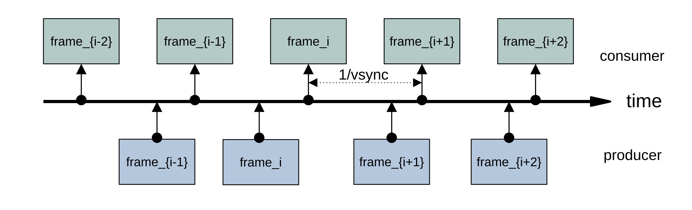

Figure 2 shows an example of a video-frame producer-consumer adaptation working correctly. The producer is in the bottom of the image, producing frames with the right frequency, and some (minor) jitter. The consumer gets a video frame every `1/VSYNC`, and ends up getting the right stream: `{f_{i-2}, f_{i-1}, fi, f_{i+1}, f_{i+2}}`.

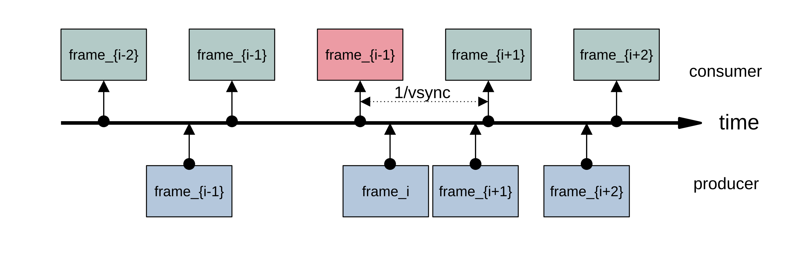

Figure 3 shows an example of a video-frame producer-consumer adaptation working incorrectly. Now we can see that the producer (in the bottom of the image) produces frames with more jitter, which causes it to lose the `VSYNC` for frame `i`. Frame `i` is produced, but only after the consumer has decided to repeat frame `i-1`. As frame `i+1` does arrive before the `VSYNC`, frame `i` ends up lost. The final stream received by the consumer is `{f_{i-2}, f_{i-1}, f_{i-1}, f_{i+1}, f_{i+2}}`.


## 1.3. End-to-End Latency

Finally, some media use cases care about the end-to-end latency. This is measured as end-to-end latency.


## 1.4. Use Case Examples

* (1) The media rendering pipeline (including video display and audio speaker) for a device. When you play a media file in your device, does it produce audio/video with correct synchronization? Is the video rendering pipeline rendering janky video?

* (2) The media capture pipeline (including video camera and audio mic) for a device. When you record a media file in your device, does it record the audio and video in-sync? Is the video capture pipeline causing the captured video to be janky?

* (3) A common media path is your favorite video conference (VC) system. A VC system starts with an "air path" (the VC captures video using a camera and audio using a mic), does processing (including sending network traffic), and ends up in another air path (the VC presents the video in a display and the audio in a speaker). Does your VC system produce audio/video with correct synchronization on the receiving side? Is the video renderer on the receiving side janky?


# 2. Metiq

The idea behind metiq is to provide a (reference) media file that the user injects into a system. The media (audio and video) gets processed through the system, and then gets captured in another media system. The capture is called the "distorted" file. metiq then analyzes the distorted media file, and measures the timing distortions (a/v sync and video smoothness).

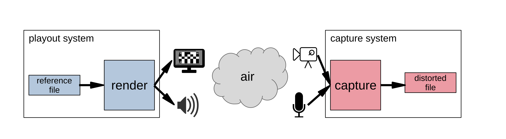

Figure 4 shows the normal example of a metiq-based system. We start with a reference file, that is pushed through an audio/video rendering system (e.g. a display and a speaker). The media is then captured through an audio/video capture system (a camera and a mic), which produces a distorted file.

Note that, while the normal metiq experiment requires starting with a video injection and ending with a video capture, the user may want to understand a simpler system. For example, let's assume the DUT (device under testing) only has a rendering part (e.g. the user's HDMI and soundbar system). In that case, the idea is to use a calibrated system on the other side of the experiment (e.g. the capture side). By using a well-known camera/mic, the user can compare the A/V sync and video smoothness of the whole system (the DUT and her calibrated camera) with another system (e.g. the user's laptop and her calibrated system).


## 2.1. Reference Generation

The reference file consists of an audio and a video stream where (a) each video frame is marked with consecutive numbers, and (b) some parts of the audio stream ("marks") are mapped uniequivocally to specific video frames (e.g. every 100 frames, i.e., at frames 0, 100, 200, 300, etc.). The idea is that, if video or audio are delayed differently, metiq would see the audio marks mapped to unexpected video frames (e.g. at frame 95 instead of frame 100). Metiq can measure the distance to the expected video frames, and therefore calculate the A/V sync value (in our case, 95 - 100 = -5 frame times, or +167 ms at 30 fps). Also, if video is not smooth (e.g. some frames are repeated while other frames are skipped), metiq will see it by comparing the reference and distorted video frame numbers.

The reference media file is synthesized so that metiq maximizes the likelihood that it can both identify the audio marks and read the original numbers in the video frames. In the audio side, this is relatively straightforward: We use an audio stream consisting of fixed-size, single-frequency, sin tones at periodic times (the audio marks are beeps). The default case is a 40 ms-long, 440 Hz tone repeated every 3 seconds. Recognizing the well-known audio marks is relatively straightforward by using signal correlation.


## 2.2. VFT Codes: Video Fine-Grained, Time-Mix-Resistant, 2D Barcodes

The video file case is slightly more complex. We want to mark each frame with a counter (consecutive frame number), and allow automatic recognition of frame numbers at the original file. A simple approach will be to use a generic barcode (e.g. a QR code). The problem of this approach is that any process that causes interpolation-based framerate conversion will mix frames, and make the QR codes unreadable.

Our approach consists of a new type of barcodes that implement a counter that supports consecutive frame mixing. We call these counters "VFT Codes", or "video fine-grain time-mix-resistant 2D barcodes". The idea is to use a [Gray code](http://en.wikipedia.org/wiki/Gray_code) for the counter. Gray codes are guaranteed to never change more than 1 bit at a time. This means that, in the worst case (where a frame is the result of interpolating 2x consecutive frames), only one of the bits will fail to be read (the one that is changing). Moreover, we can make sure that the bit that fails to read is the one that should be changing at the moment.

For example, when using 16-bit counters, the Gray code for 11 is `0000,0000,0000,1110`, while that for 12 is `0000,0000,0000,1010`. If we read the counter bits in a frame as `0000,0000,0000,1X10` (where `X` means "undecided"), we know that the possible values for the counter are 11 (if `X` is 1) or 12 (if `X` is 0). As the numbers are consecutive, we assume we are seeing a frame resulting of the mixing of 2x consecutive frames, and count the video capture timestamp as "11.5". If, instead, the reading is `0000,0000,0X00,1110`, the possible readings are 11 (if `X` is 0) and 116 (if `X` is 1), which means the frame was not read correctly.

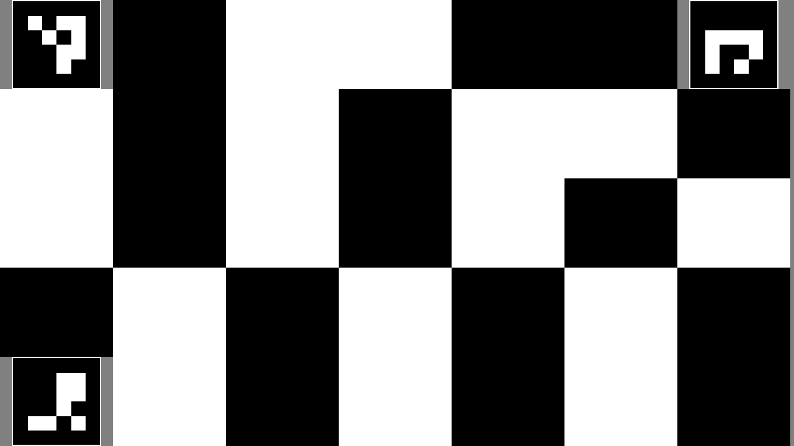

Figure 5 shows an example of a VFT code. The design is as follows:

* We add 3x [fiducial markers](https://en.wikipedia.org/wiki/Fiducial_marker) in the corners of the VFT code to support affine transformations on the material. The idea is to allow measuring displays and cameras where the positioning of the camera is not perfect. This allows an analyzer to understand the position of the camera (and recover the frame in the original position through an affine transformation). We use [ArUco markers](https://clover.coex.tech/en/aruco.html) as fiducials.

* We add the value by writing its bits as square blocks containing black or white forming a [Gray code](http://en.wikipedia.org/wiki/Gray_code). This occupies the rest of the barcode. Note that we print each bit in the Gray code twice (once in black and once in white) in order to maximize the chances to read the counter reliably.

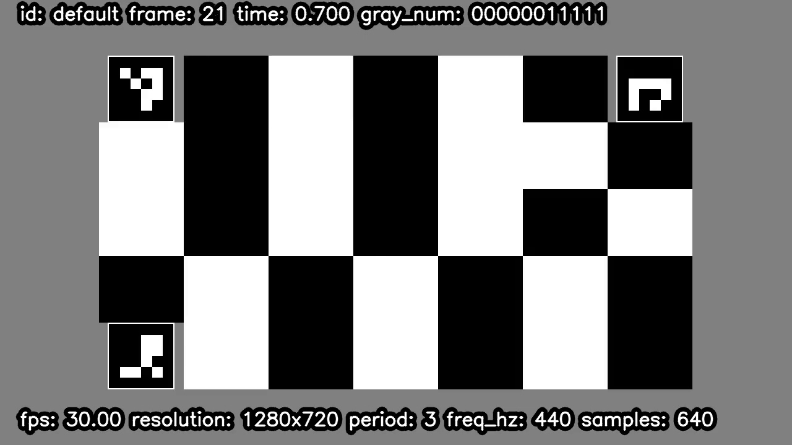

Figure 6 shows an example of a video frame from a metiq file. Note the VFT code in the middle.

In order to understand how the Gray code works, we used the ffmpeg minterpolate filter to generate a 60 fps from a metiq 30 fps video.

```
$ ffmpeg -i /tmp/metiq.mp4 -filter:v minterpolate=fps=60 /tmp/metiq.60fps.mp4
```

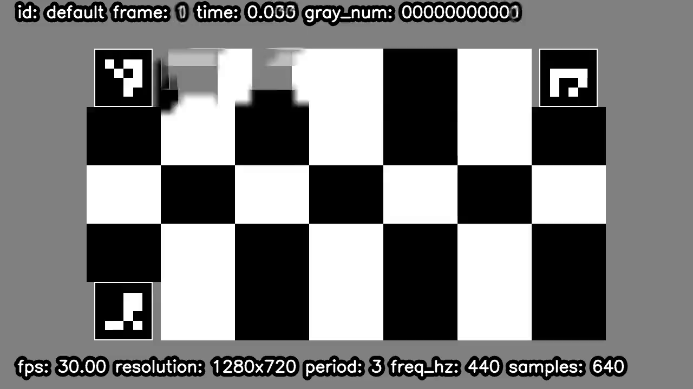

Figure 7 shows an example of an odd frame (frame 1) of a 30 fps metiq file interpolated to 60 fps. Remember that while the even frames are copied one-to-one from the original frames, the odd ones are interpolated between each 2x consecuive frames. So frame 1 in the output is the results of `mix(f0,f1)` in the input. We can see how minterpolate mixed the 2x bit blocks on the top-left, just beside one of the fiducials. The VFT analyzer reads the bitstring as `0000,0000,0000,000X`. The 2x possible values are 0 (if X=0) and 1 (if X=1), which are consecutive. Therefore the output number is 0.5.


# 3. Operation

## 3.1. Reference Video Generation

The first step is to generate a media file. The following command generates a media file, with audio and video stream:
```
$ ./metiq.py generate -o /tmp/metiq.mp4
```

The generation command supports the following video parameters:

* `--width WIDTH`: set the width of the video stream.
* `--height HEIGHT`: set the height of the video. Both width and height can be set at the same time using `--video-size VIDEO_SIZE`, where the parameter follows the "`<width>x<height>`" syntax.
* `--fps FPS`: set the framerate of the metiq video.
* `--num-frames NUM_FRAMES`: set the exact length of the metiq file (in video frame units).
* `--pixel-format PIXEL_FORMAT`: set the pixel format of the video stream.
* `--vft-id VFT_ID`: set the VFT type. We support different VFT subtypes, depending on the density of blocks the user wants to use. Right now we support 9x8, 9x6, 7x5 (default), and 5x4.
* `--vft-tag-border-size BORDER_SIZE`: the border size of the VFT fiducials. This is required for identifying the fiducials.

The generation command supports the following audio parameters (note that the length is defined by the video stream):

* `--pre-samples pre_samples`: number of samples
* `--samplerate samplerate`: audio samplerate, in Hz.
* `--beep-freq beep_freq`: audio beep frequency, in Hz.
* `--beep-duration-samples beep_duration_samples`: beep duration, in samples.
* `--beep-period-sec beep_period_sec`: beep period, in seconds.
* `--scale scale`: audio volume (scale value in the [0, 1] range used to set the peak value of the sin).


## 3.2. Experiment Running

Use the video generated in the previous step to test a media path. Some examples include:

* 1. test the video smoothness and a/v sync of a camera by playing the metiq.mp4 file in a display, and capturing its audio and video with a camera located in front of the display.
* 2. test the video smoothness and a/v sync of a display by playing the metiq.mp4 file in it, and capturing the display audio and video using a camera.
* 3. test the video smoothness and a/v sync of a VC system by playing the metiq.mp4 file in a display located in front of the VC camera, and capturing the rendered audio and video with a camera located in front of the VC's display system.

Any of these processes should produce a capture file, called the "distorted video."


## 3.3. Distorted Video Analysis

Run the `analyze` subcommand on the distorted file.
```
$ ./metiq.py analyze -i distorted.mp4 -o /tmp/distorted.csv
```

The analysis command supports the following video parameter:

* `--luma-threshold LUMA_THRESHOLD`: set the luma threshold used to identify bits. This is a value between 0 and 255. The default is 100. A lower value will produce less cases of not being able to recognize the number in the VFT code, at the cost of increasing the errors on recognizing the frame numbers. A higher value would do the opposite. We recommend setting the value to 20 where there was a camera involved, and 100 when it is just video processing.


Let's try first with the file interpolated to 60 fps.
```
$ ./metiq.py analyze -i /tmp/metiq.60fps.mp4 -o /tmp/distorted.csv
...
avsync_sec average: 0.017499999999999998 stddev: 0.006400954789890507 size: 20
video_delta_info = {'mode': -0.5, 'stddev': 0.08755989545631634, 'ok_ratio': 0.9480122324159022, 'sok_ratio': 0.9780372532666111, 'nok_ratio': 0.0, 'unknown_ratio': 0.021962746733388935}
```

The output is composed of 2 lines and a data file (CSV format):

* 1. The first line shows the A/V sync, using the traditional approach (positive values if the audio is earlier than it should be, and negative values if the audio is later than it should be). In this case the A/V sync is +17 ms (positive, so the audio is slightly earlier than it should be), which is in the "very good" range. We also provide the standard deviation, and the number of correct samples that he analyzer used to calculate the statistics (20 in this case).

* 2. The second line shows the video smoothness measurement, composed of 5x statistics. The first 2x are the mode and standard deviation of the difference between the read frame number and the actual video frame number. The exact mode value is not very important, as it depends on the start of the video. If your capture starts e.g. around frame 93, the mode should be 93. The interesting number is the standard deviation. It tells you how smooth was the video. The other 3x statistics describe, from all the frames in the video file, the following ratios:
* 2.1. `ok_ratio`: ratio of video frames that were read correctly and were matched exactly to the actual frame number in the file (`ok_ratio`, 95% in this case),
* 2.2. `sok_ratio`: ratio of video frames that were read correctly and were matched almost exactly (with a 0.5 frame difference) to the actual frame number in the file (`sok_ratio`, 98% in this case),
* 2.3. `nok_ratio`: ratio of video frames that were read correctly, but were not close to the expected frame number in the file (`nok_ratio`, 2% in this case), and
* 2.4. `unknown_ratio`: ratio of video frames that were not read correctly, due to the analyzer either not recognizing the fiducial markers, or being able to undo bit block errors in the Gray code -- 2.2% in this case). The `unknown_ratio` is also a measurement of the quality of the video path (e.g. position of the camera, etc.). In this case, 95% of the video frames had the expected frame number.

* 3. The CSV file contains a full dump of what the analyzer saw in the video. For example, in our 30-to-60 fps minterpolate file, we see:

```
$ csvlook /tmp/distorted.csv
| timestamp | video_frame_num | video_frame_num_expected | video_frame_num_read | video_delta_frames_-0.5 | audio_sample_num | audio_correlation |
| --------- | --------------- | ------------------------ | -------------------- | ----------------------- | ---------------- | ----------------- |
|     0.000 |               0 |                    0.000 |                  0.0 |                     0.5 |                0 |   167,150,682,112 |
|     0.033 |               1 |                    1.000 |                  0.5 |                     0.0 |                  |                   |
|     0.050 |               2 |                    1.500 |                  1.0 |                     0.0 |                  |                   |
|     0.067 |               3 |                    2.000 |                  1.5 |                     0.0 |                  |                   |
|     0.083 |               4 |                    2.500 |                  2.0 |                     0.0 |                  |                   |
|     0.100 |               5 |                    3.000 |                  2.5 |                     0.0 |                  |                   |
|     0.117 |               6 |                    3.500 |                  3.0 |                     0.0 |                  |                   |
|     0.133 |               7 |                    4.000 |                      |                         |                  |                   |
|     0.133 |               8 |                    4.000 |                  4.0 |                     0.5 |                  |                   |
|     0.167 |               9 |                    5.000 |                  4.5 |                     0.0 |                  |                   |
|     0.183 |              10 |                    5.500 |                  5.0 |                     0.0 |                  |                   |
|     0.200 |              11 |                    6.000 |                  5.5 |                     0.0 |                  |                   |
...
|     2.950 |             176 |                   88.500 |                 88.0 |                     0.0 |                  |                   |
|     2.967 |             177 |                   89.000 |                 88.5 |                     0.0 |                  |                   |
|     2.983 |             178 |                   89.500 |                 89.0 |                     0.0 |                  |                   |
|     3.000 |             179 |                   90.000 |                 89.5 |                     0.0 |           48,000 |   167,533,641,728 |
|     3.017 |             180 |                   90.500 |                 90.0 |                     0.0 |                  |                   |
|     3.033 |             181 |                   91.000 |                 90.5 |                     0.0 |                  |                   |
|     3.050 |             182 |                   91.500 |                 91.0 |                     0.0 |                  |                   |
|     3.067 |             183 |                   92.000 |                 91.5 |                     0.0 |                  |                   |
...
```

Column 1 is a timestamp. Columns 2-5 show video information, while columns 6-7 show audio information.

Some interesting lines in this experiments are:

* The media file started at time -0.5. This is caused by a minor issue on the timestamp of the first few frames. Note that there is no frame at 0.117. This seems like an ffmpeg corner case issue.

* At time 0.000, the analyzer saw both a video frame (frame 0, where it read "frame 0.0"), and an audio match (sample number 0). At time 3.000, the analyzer saw again both a video frame (frame 180), where it read "frame 89.5"), and an audio match (sample number 48000, or 3x seconds at the default 16 kHz).

* At time 0.033, the analyzer saw a video frame (frame 1), where it read "frame 0.5"). In other words, it saw a frame with an unknown bit, and it returned the average of the 2x possible (consecutive) readings. There was no audio match in this timestamp.

* At time 0.133, the analyzer was not able to parse the VFT in the video frame. We checked the problem, an it is caused by minterpolate mixing modifying pixels in the video that are the same in both frames.


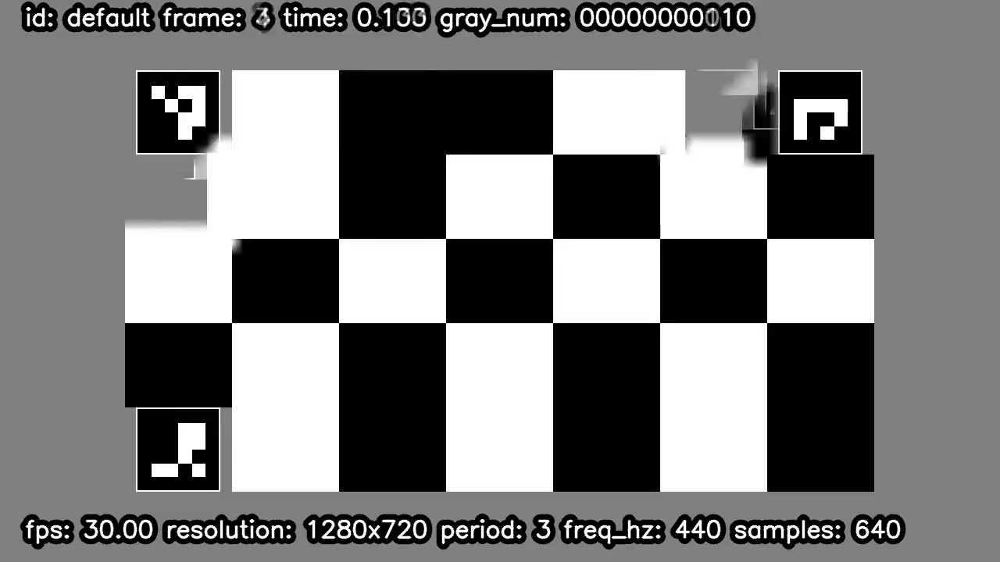

Figure 8 shows frame 7, which metiq cannot analyze. Note the blurred corner in the top-left fiducial.

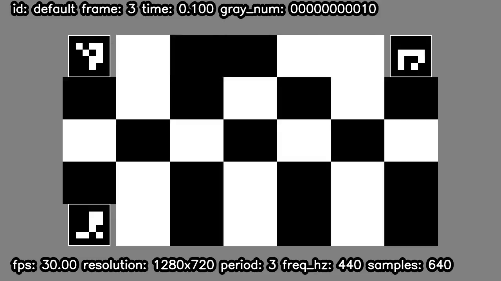

Figure 9 shows frame 6, the frame before frame 7.

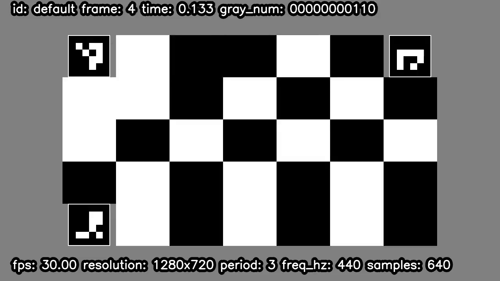

Figure 10 shows frame 8, the frame after frame 7.


# 4. Results

## 4.1. Let's Get a Reliable Display/Camera: Play video on a MacBook Pro (MBP), Capture on a Pixel 7 Phone

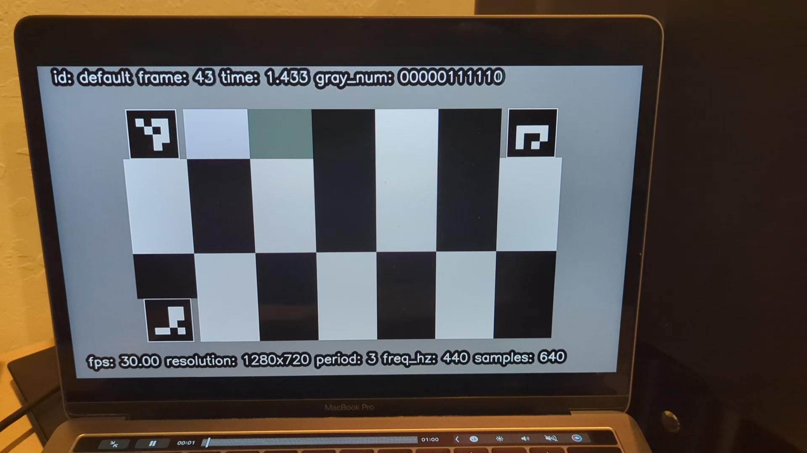

Figure 11 shows frame 4 in the distorted file.

```
avsync_sec average: 0.014046706202096193 stddev: 0.001477636238767384 size: 5
video_delta_info = {'mode': 40.0, 'stddev': 0.04406518152881761, 'ok_ratio': 0.9903474903474904, 'sok_ratio': 0.9903474903474904, 'nok_ratio': 0.0019305019305019305, 'unknown_ratio': 0.007722007722007722}
```
```
$ csvlook results/mbp.mp4.csv
| timestamp | video_frame_num | video_frame_num_expected | video_frame_num_read | video_delta_frames_40.0 | audio_sample_num | audio_correlation |
| --------- | --------------- | ------------------------ | -------------------- | ----------------------- | ---------------- | ----------------- |
|     0.000 |               0 |                    0.000 |                   41 |                       1 |                  |                   |
|     0.067 |               1 |                    2.005 |                   42 |                       0 |                  |                   |
|     0.100 |               2 |                    3.005 |                   43 |                       0 |                  |                   |
|     0.134 |               3 |                    4.006 |                   44 |                       0 |                  |                   |
|     0.167 |               4 |                    5.006 |                   45 |                       0 |                  |                   |
|     0.200 |               5 |                    6.006 |                   46 |                       0 |                  |                   |
|     0.234 |               6 |                    7.007 |                   47 |                       0 |                  |                   |
|     0.267 |               7 |                    8.002 |                   48 |                       0 |                  |                   |
...
|    17.240 |             516 |                  517.192 |                  557 |                       0 |                  |                   |
|    17.273 |             517 |                  518.190 |                  558 |                       0 |                  |                   |
```

Discussion:

* The A/V sync is +14 ms (positive, so the audio is slightly earlier than it should be), which is in the "very good" range.

* The video smoothness stddev is 0.044, which suggests that the video is rendered and captured very smoothly. We could read the expected frame number in 99% of the captured frames. Only frame with a different value is the first frame, where the difference is 41 (a delta of +1). Again, the same ffmpeg initial frame issue: The timestamp difference between the first 2x frames is 66 ms, instead of the 33 for every other frames.

What this is telling us is that (a) the MBP is a very good display device in terms of video smoothness and a/v sync, and (b) the pixel7 is a very good camera device in terms of video smoothness and a/v sync.


## 4.2. Compare Linux and MBP Rendering: Play video on a Linux host, Capture on a Pixel 7 Phone

```
$ ./metiq.py analyze -i results/linux.mp4 -o results/linux.mp4.csv --luma-threshold 20
avsync_sec average: 0.04519844689732911 stddev: 0.013888224088450946 size: 10
video_delta_info = {'mode': 49.0, 'stddev': 0.5202005449271158, 'ok_ratio': 0.38596491228070173, 'sok_ratio': 0.8255933952528379, 'nok_ratio': 0.17027863777089783, 'unknown_ratio': 0.0041279669762641896}

$ ./metiq.py analyze -i ~/Downloads/linux2.mp4 -o results/linux2.mp4.csv --luma-threshold 20
avsync_sec average: 0.03786762455101281 stddev: 0.0025083974753323285 size: 9
video_delta_info = {'mode': 38.0, 'stddev': 0.23975474855459034, 'ok_ratio': 0.7480314960629921, 'sok_ratio': 0.984251968503937, 'nok_ratio': 0.015748031496062992, 'unknown_ratio': 0.0}

$ ./metiq.py analyze -i ~/Downloads/linux3.mp4 -o results/linux3.mp4.csv --luma-threshold 20
avsync_sec average: 0.04051982628667408 stddev: 0.010996596907040137 size: 10
video_delta_info = {'mode': 35.5, 'stddev': 0.3557484186346338, 'ok_ratio': 0.45211122554067973, 'sok_ratio': 0.9948506694129763, 'nok_ratio': 0.0010298661174047373, 'unknown_ratio': 0.004119464469618949}
```

Discussion:

* The A/V sync is between +24.4 and +49 ms (positive, so the audio is slightly earlier than it should be). Results are always in the Steinmetz and ITU-R BT.1359-1 good ranges, and slightly above the EBU R37-2007 goodness range in the worst case. The a/v sync in the linux host is slightly worse than in the MBP case.

* The video smoothness stddev of the video smoothness is large (0.520, 0.240, 0.356), which is large. In the worst case, 17% of the frames were read with the wrong frame number. If we check the actual readings:


```
$ csvlook results/linux.mp4.csv
| timestamp | video_frame_num | video_frame_num_expected | video_frame_num_read | video_delta_frames_49.0 | audio_sample_num | audio_correlation |
| --------- | --------------- | ------------------------ | -------------------- | ----------------------- | ---------------- | ----------------- |
|     0.000 |               0 |                    0.000 |                 50.0 |                     1.0 |                  |                   |
|     0.067 |               1 |                    2.001 |                 51.0 |                     0.0 |                  |                   |
|     0.100 |               2 |                    3.001 |                 52.0 |                     0.0 |                  |                   |
|     0.133 |               3 |                    4.001 |                 53.0 |                     0.0 |                  |                   |
|     0.167 |               4 |                    5.002 |                 54.0 |                     0.0 |                  |                   |
|     0.200 |               5 |                    6.002 |                 55.0 |                     0.0 |                  |                   |
|     0.233 |               6 |                    7.002 |                 56.0 |                     0.0 |                  |                   |
...
|    17.740 |             531 |                  532.193 |                582.0 |                     1.0 |                  |                   |
|    17.773 |             532 |                  533.193 |                583.0 |                     1.0 |                  |                   |
|    17.806 |             533 |                  534.193 |                583.0 |                     0.0 |                  |                   |
|    17.840 |             534 |                  535.194 |                585.0 |                     1.0 |                  |                   |
|    17.873 |             535 |                  536.194 |                586.0 |                     1.0 |                  |                   |
|    17.906 |             536 |                  537.195 |                587.0 |                     1.0 |                  |                   |
...
```


## 4.3. What About Mobile Phone Displays: Play video on a Pixel 5 Phone, Capture on a Pixel 7 Phone

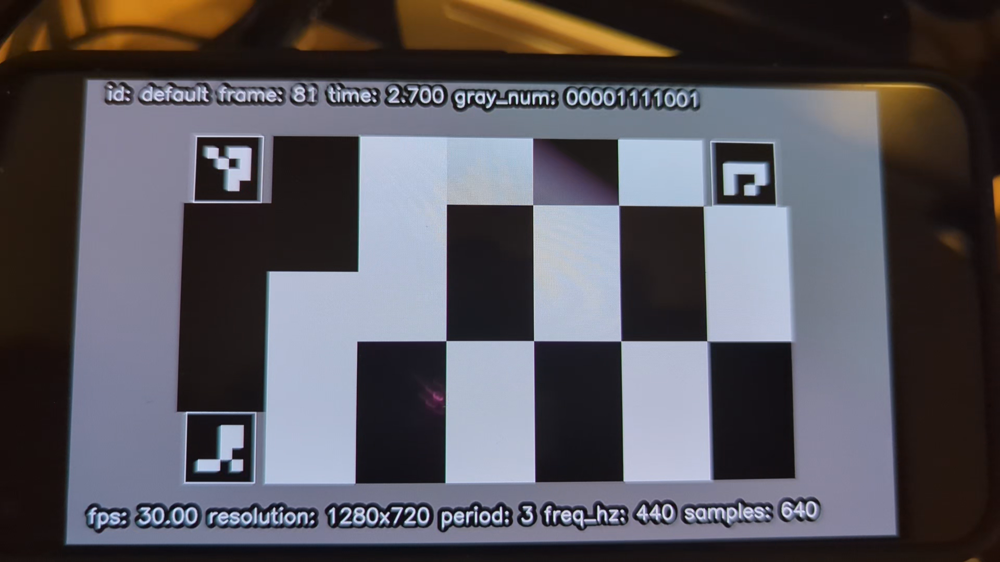

Figure 12 shows frame 4 in the distorted file.

```
$ ./metiq.py analyze -i results/pixel5.mp4 -o results/pixel5.mp4.csv --luma-threshold 20
...
avsync_sec average: -0.13457056037083256 stddev: 0.018462374917257118 size: 5
video_delta_info = {'mode': 79.0, 'stddev': 0.4658808345619546, 'ok_ratio': 0.48303393213572854, 'sok_ratio': 0.6067864271457086, 'nok_ratio': 0.3932135728542914, 'unknown_ratio': 0.0}
```

Discussion:

* The A/V sync is -134 ms (negative, so the audio is slightly later than it should be), which is outside the Steinmetz and EBU R37-2007 ranges. It is barely in the ITU-R BT.1359-1 acceptable range.

* The video smoothness stddev of the video smoothness is 0.466, which is very large. In fact, 40% the frames were read with the frame number 1 or more frame away from the right number. If we check the actual readings:

```
$ csvlook results/pixel5.mp4.csv
| timestamp | video_frame_num | video_frame_num_expected | video_frame_num_read | video_delta_frames_79.0 | audio_sample_num | audio_correlation |
| --------- | --------------- | ------------------------ | -------------------- | ----------------------- | ---------------- | ----------------- |
|     0.000 |               0 |                    0.000 |                 79.0 |                     0.0 |                  |                   |
|     0.067 |               1 |                    2.001 |                 80.0 |                    -1.0 |                  |                   |
|     0.100 |               2 |                    3.001 |                 81.0 |                    -1.0 |                  |                   |
|     0.133 |               3 |                    4.001 |                 82.0 |                    -1.0 |                  |                   |
|     0.167 |               4 |                    5.002 |                 83.0 |                    -1.0 |                  |                   |
...
|     5.902 |             176 |                  177.064 |                255.0 |                    -1.0 |                  |                   |
|     5.935 |             177 |                  178.064 |                256.0 |                    -1.0 |                  |                   |
|     5.969 |             178 |                  179.065 |                258.0 |                     0.0 |                  |                   |
|     6.002 |             179 |                  180.065 |                259.0 |                     0.0 |                  |                   |
|     6.036 |             180 |                  181.065 |                259.0 |                    -1.0 |                  |                   |
|     6.069 |             181 |                  182.066 |                260.0 |                    -1.0 |                  |                   |
|     6.102 |             182 |                  183.066 |                262.0 |                     0.0 |                  |                   |
...
|    12.338 |             369 |                  370.134 |                449.0 |                     0.0 |                  |                   |
|    12.371 |             370 |                  371.134 |                449.5 |                    -0.5 |                  |                   |
|    12.404 |             371 |                  372.135 |                451.0 |                     0.0 |                  |                   |
|    12.438 |             372 |                  373.135 |                452.0 |                     0.0 |                  |                   |
...
|    16.606 |             497 |                  498.180 |                576.0 |                    -1.0 |                  |                   |
|    16.639 |             498 |                  499.181 |                577.0 |                    -1.0 |                  |                   |
|    16.673 |             499 |                  500.181 |                578.0 |                    -1.0 |                  |                   |
|    16.706 |             500 |                  501.180 |                579.0 |                    -1.0 |                  |                   |
```

Note that the mode of the difference between actual the expected video frame number and the value actually read is 79. For the first few and last images, the actual difference was 78 (relative delta of -1). For the frames in the middle of the experiment, the value is actually 79 (relative delta of 0). This is interesting.

This is telling us is that the pixel5 as a display device is mediocre for both A/V sync and video smoothness measurements.


## 4.4. Pixel Phones Are The Best Android Devices, Right? Play video on a Pixel 5 Phone, Capture on an Android Device

```
$ ./metiq.py analyze -i results/android.mp4 -o results/android.mp4.csv --luma-threshold 20
...
avsync_sec average: -0.15188550357518552 stddev: 0.03219655447949604 size: 5
video_delta_info = {'mode': 62.0, 'stddev': 0.04719280024970085, 'ok_ratio': 0.8514285714285714, 'sok_ratio': 0.8514285714285714, 'nok_ratio': 0.0019047619047619048, 'unknown_ratio': 0.14666666666666667}
```

Discussion:

* The A/V sync is -152 ms (negative, so the audio is slightly later than it should be), which is outside the Steinmetz and EBU R37-2007 ranges. It is barely in the ITU-R BT.1359-1 acceptable range.

* The video smoothness stddev of the video smoothness is 0.047, which is very good. We could read the expected frame number in 85% of the video frames.

So comparing this Android device with a Pixel 5, it seems to be much better at rendering smooth video, while as bad at rendering audio and video in sync.


## 4.5. My Bluetooth Speaker Introduces Delay: Play audio on a Phone vs. Bluetooth Speaker

In this example, we captured video from an android device (Pixel 6a) 2x times. The first time, we used the internal speaker. The second time, we used an external Bluetooth speaker ([Anker Soundcore Bluetooth Speaker](amazon.com/gp/product/B016XTADG2/)).


First the results without the speaker:

```
$ ./metiq.py analyze -i results/pixel6a.mp4 -o results/pixel6a.mp4.csv --luma-threshold 20
...
avsync_sec average: -0.12069886031895435 stddev: 0.007473285230650919 size: 8
video_delta_info = {'mode': 174.0, 'stddev': 0.4110203573318829, 'ok_ratio': 0.6048387096774194, 'sok_ratio': 0.7849462365591398, 'nok_ratio': 0.2110215053763441, 'unknown_ratio': 0.004032258064516129}
```


Second the results with the speaker:
```
$ ./metiq.py analyze -i results/pixel6a.bt.mp4 -o results/pixel6a.bt.mp4.csv --luma-threshold 20
...
avsync_sec average: -0.24893367284771728 stddev: 0.014296892894416305 size: 9
video_delta_info = {'mode': 142.0, 'stddev': 0.32879964224067765, 'ok_ratio': 0.7104959630911188, 'sok_ratio': 0.9480968858131488, 'nok_ratio': 0.05190311418685121, 'unknown_ratio': 0.0}
```

Comparing the first lines in both experiments, we can see that the A/V sync is negative in both cases (the audio is later than it should be). Without the sepaker, the A/V sync is -121 ms, which is outside the Steinmetz and EBU R37-2007 ranges, and barely in the ITU-R BT.1359-1 acceptable range. With the speaker, the A/V sync is -249 ms, which is definitely noticeable.


```
$ ./metiq.py analyze -i results/pixel6a.bt.1m.mp4 -o results/pixel6a.bt.1m.mp4.csv --luma-threshold 20
...
avsync_sec average: -0.27831445225523677 stddev: 0.014861238666310513 size: 9
video_delta_info = {'mode': 259.0, 'stddev': 0.4177680874837188, 'ok_ratio': 0.4431554524361949, 'sok_ratio': 0.9280742459396751, 'nok_ratio': 0.06844547563805105, 'unknown_ratio': 0.0034802784222737818}
```

```
$ ./metiq.py analyze -i results/pixel6a.bt.wall.mp4 -o results/pixel6a.bt.wall.mp4.csv --luma-threshold 20
...
avsync_sec average: -0.2714650419747814 stddev: 0.013496314738270662 size: 12
video_delta_info = {'mode': 86.0, 'stddev': 0.4418732130047532, 'ok_ratio': 0.4298642533936652, 'sok_ratio': 0.8235294117647058, 'nok_ratio': 0.16832579185520363, 'unknown_ratio': 0.008144796380090498}
```


